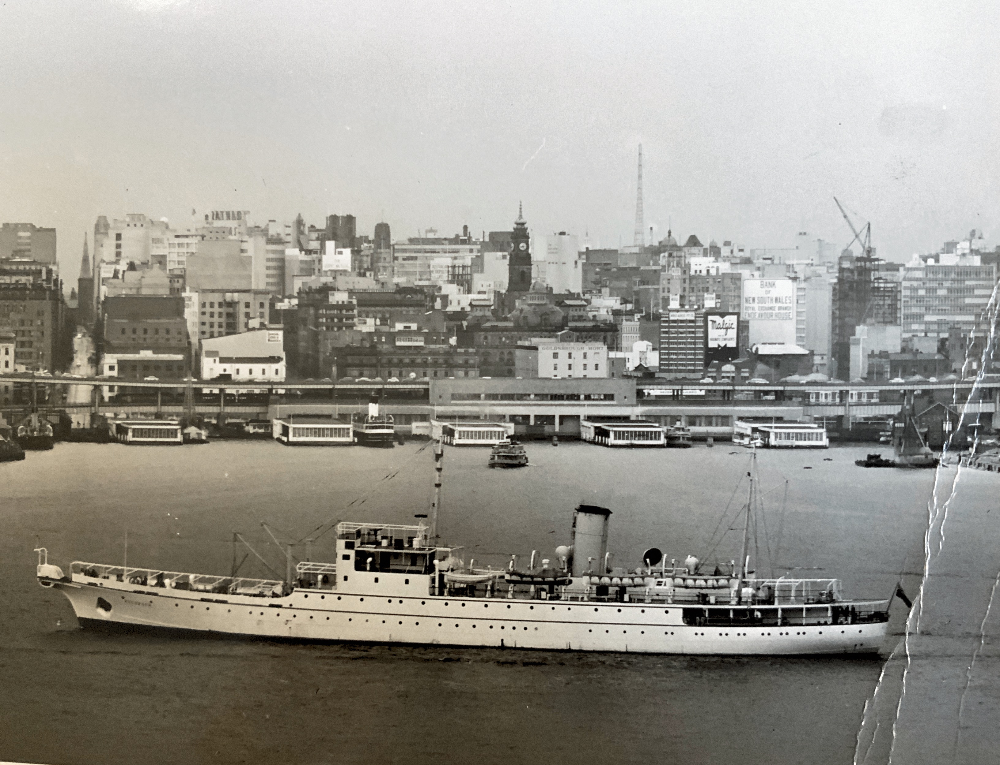

# What is MorAce?

## morAce

morAce is a Arduino project designed to work with the [Adafruit nrf52840](https://www.adafruit.com/product/4062) range of arduino boards - and converts 1, 2 or 3 switch inputs into HID keyboard/Mouse commands. A mode switch allows the device to switch between connected devices meaning you can use this on different computers - with no software or cables since its over Bluetooth

### What does it do exactly?

You can use switches (1, 2, or 3) to send morse code signals which are then intepreted by the morAce as Keyboard strokes or mouse movements. Its configurable by editing the arduino file. It will work on any device that listens to a Bluetooth keyboard our mouse - such as an iOS device, Mac, Windows devices. Also with a fourth switch you can change which device it is currently connected to. It cycles between already paired devices.

### Want to learn morse?

Try our [Morse-Learn](https://github.com/AceCentre/morse-learn/) Project.

Or if you are on a PC and want a way of learning how to use the morse with visual feedback (and word prediction)  try [MorseWriter](https://github.com/AceCentre/MorseWriter).

### Why did you make this?

We had 1 then 2 then 3 clients who all needed Morse input solutions for speech. These were typically adults who were literate and either had a significant visual difficulty and reduced physical skills (but in general at least one switch site or two switches with good timing skills) or had learnt morse earlier in life. See a bit more on this [here](https://acecentre.org.uk/projects/morse-code). As much as other solutions existed we needed to do it over bluetooth - and two clients needed it to work across phone and a windows device.&#x20;

### Why is it called morAce? How should I pronounce that?!

More-Ace. or Maurice. Whatever you prefer. Thanks to [Michael Ritson](https://acecentre.org.uk/about/staff/michael-ritson) for naming this. Little did he know when he came up with that [Will Wade](https://acecentre.org.uk/about/staff/will-wade), who initally wrote this comes from a family where morse code and radio operating was talked about a lot as his dad - Maurice James Wade (Jim) spent his early years as a radio operator for Cable ships sailing the world.&#x20;

 
