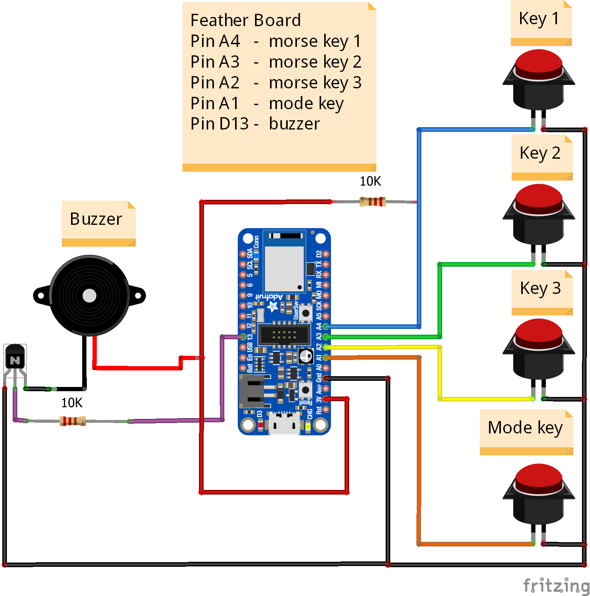

# Developer notes

### Bill of materials

1 x Ace Centre x80 or:

* x1 [Adafruit nrf52840](https://www.adafruit.com/product/4062) or [Adafruit nrf52840 itsybitsy](https://www.adafruit.com/product/4481)
* x3 [3.5mm Socket](https://www.hobbytronics.co.uk/stereo-audio-jack-socket) (or any [momentary buttons](https://www.hobbytronics.co.uk/push-switch-12mm))
* x1 [Buzzer](https://www.hobbytronics.co.uk/piezo-transducer-5v)
* x1 [PNP](https://www.hobbytronics.co.uk/bc212l-pnp-transistor)
* x1 [10K resistor](https://www.hobbytronics.co.uk/resistor-10k-1-8w)
* x1 Neopixel

Download the firmware here. Note - if you prefer C take a look at the ArduinoC branch. We wont be keeping this up to date but has most of the key features.&#x20;

### Arduino wiring

* **Pin** 10 - Morse Key 1 **State**: Active Low (External switch)
* **Pin** 11 - Morse Key 2 **State**: Active Low (External switch)
* **Pin** 12 - Morse Key 3 **State**: Active Low (External switch)
* **Pin** 5 - Buzzer **State**: Active Low (External switch)
* **USER Switch** - Switch for Connection Swapping **State**: Active Low (On board - Feather User SW)
* **CONN LED(Blue)** - LED indication for BLE Connection status **State**:Active High ("On board - Feather CONN LED - Blinking : Advertising, Not connected, Steady ON : Connected, Not advertising")

See also this [Fritzing diagram](https://github.com/AceCentre/BLEMorseToText/blob/master/ConnectionDiagram.fzz)&#x20;

<figure><figcaption></figcaption></figure>

#### Usage

Wire it all up. Set your settings in `userConfig.py`. Make sure your board is setup to run CircuitPy ([itsybitsy guide ](https://learn.adafruit.com/adafruit-itsybitsy-nrf52840-express/circuitpython)and [feather guide](https://www.adafruit.com/product/4062)) and drag and drop the files to the _CIRCUITPY_ disk drive. Pair your device with a compatible device (PC, Mac, Linux, iOS, Android) - and away you go.

There **will** be bugs. Please submit them to the [issue queue](https://github.com/AceCentre/BLEMorseToText/issues).

### Contributing

Pull requests are welcome. For major changes, please open an issue first to discuss what you would like to change.

### Files

All the Arduino code is in the sub-directory morace [subdirectory](https://github.com/AceCentre/morAce).&#x20;

For the main branch (CircuitPy):

* boot.py - Code that runs on boot. Note the logic in here to turn on/off filesystem wriing
* code.py - The main loop
* extern.py - Helper functions
* morseCode.py - morse code mapping&#x20;
* userConfig.py - User configurable data. Should be well documented
* userPinMap.py - Map your pins here
* x80PinMap.py - Uses our X80 pin maps\

For the [ArduinoC](https://github.com/AceCentre/morAce/tree/ArduinoC) branch:

* Morse\_BLE\_HID.ino - Main source code file
* morseCode.cpp - Library source code file for Morse Code related functions
* morseCode.h - Library header file for Morse Code related functions
* userConfig.h - Configuaration File for settings
* userPinMap.h - Pin mapping file

### Why? Why not a different project?

We needed a BLE HID Switch->Morse system - that allowed swapping between several different devices - AND - switching between switch scanning and morse input.

### Credits

* Tania Finlayson - and her husband for developing (and general all round awesomeness) for building [TandemMaster](http://tandemmaster.org). Please buy one if you want to support this project
* Jim Lubin - and his fab Morse archive [here](https://www.makoa.org/jlubin/morsecode.htm)
* [Adaptive Design](https://www.adaptivedesign.org) - who have been great recently about pushing along the morse agenda
* Adafruit. For being amazing.
* [deeproadrash](https://www.freelancer.co.uk/u/deeproadrash) who helped immensely with a lot of the code on this project.&#x20;
* [f1andrew](https://github.com/f1andrew) - Andrii Pavlyshyn who has done a lot of the changes to circuitPy and ironed out a lot of bugs. :heart::flag\_ua:

### Similar projects

* [ATMakers - AirTalker](https://github.com/ATMakersOrg/AirTalker) - A really nice replica of the Adap2U sip/puff Morse code to keyboard/mouse system used by Jim Lubin. Its neat - runs on CircuitPython. The BLE libraries though arent full featured yet.
* [Morsel](https://github.com/derekyerger/morsel). One of the few that attempt to this project over bluetooth. Ours has a few more features than this.
* [Ketcha-K - morsekey project](https://github.com/ketcha-k/morsekey). This was a bit of a kickstart to do this project (see also [this thread on reddit](https://www.reddit.com/r/arduino/comments/gaplhs/usb\_morse\_key\_using\_pro\_micro/))
* [Milad Hajihassan, Makers Making Change - and the FAIO project](https://www.makersmakingchange.com/project/faio-feather-all-in-one-switch/) - a neat project which has some morse functionality built in using the [easymorse project](https://github.com/milador/EasyMorse). Also uses the feather. (See more at [FAIO Multiplexer](https://github.com/milador/FAIO\_Multiplexer))
* [OllieBck / MorseBLEKeyboard](https://github.com/OllieBck/MorseBLEKeyBoard) - a project to switch between switch scanning and using Gboard.
* [K3NG / Arduino CW Keyer](https://blog.radioartisan.com/arduino-cw-keyer/) - this project has EVERYTHING you would ever need for proper morse code. We doff our cap..

### License

[MIT](../../LICENSE)

